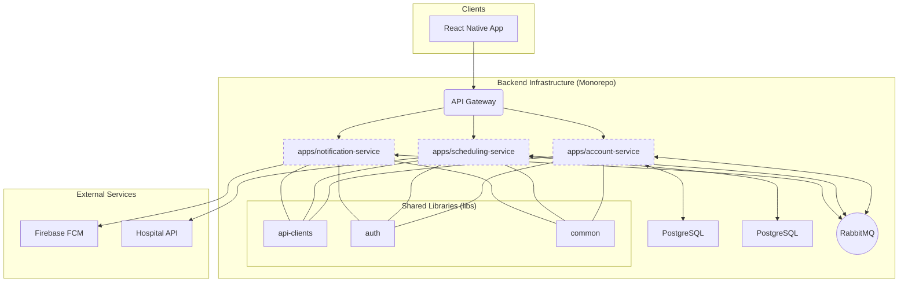

# Tài Liệu Kiến Trúc: Ngăn Xếp Công Nghệ (Technology Stack)

**Phiên bản:** 1.0
**Tác giả:** [Tên của bạn/Team]
**Ngày cập nhật:** [Ngày hôm nay]

## 1. Giới thiệu

Tài liệu này cung cấp một cái nhìn tổng quan về các công nghệ, frameworks, và thư viện được sử dụng để xây dựng và vận hành hệ thống backend của MedPlusApp. Mục tiêu là tạo ra một nguồn tham khảo duy nhất, giúp các thành viên trong đội ngũ kỹ thuật hiểu rõ môi trường và các quyết định kiến trúc đã được đưa ra.

## 2. Sơ đồ Tổng quan Kiến trúc

Sơ đồ này minh họa các thành phần chính của hệ thống và mối quan hệ giữa chúng.

## 3. Chi tiết Ngăn xếp Công nghệ

### 3.1. Nền tảng & Framework Chính

| Hạng mục                  | Công nghệ / Công cụ                               | Lý do lựa chọn                                                                                             |
| ------------------------- | ------------------------------------------------- | ----------------------------------------------------------------------------------------------------------- |
| **Ngôn ngữ & Nền tảng**    | TypeScript (v5.7+), Node.js (>=18)                | Cung cấp type-safety mạnh mẽ, hiệu năng cao cho các tác vụ I/O, và một hệ sinh thái thư viện khổng lồ.        |
| **Framework**             | NestJS (v11.x)                                    | Một framework Node.js cấp tiến, cung cấp kiến trúc module hóa, Dependency Injection, và tích hợp sâu với TypeScript, rất phù hợp cho các ứng dụng doanh nghiệp. |
| **Kiến trúc Monorepo**    | NestJS CLI Workspaces                             | Quản lý hiệu quả các `apps` (microservices) và `libs` (thư viện dùng chung) trong cùng một codebase, thúc đẩy tái sử dụng và tính nhất quán. |

### 3.2. Giao tiếp & API

| Hạng mục                  | Công nghệ / Công cụ                               | Lý do lựa chọn                                                                                             |
| ------------------------- | ------------------------------------------------- | ----------------------------------------------------------------------------------------------------------- |
| **Giao tiếp API (Client)**| GraphQL (`@nestjs/graphql`, `@apollo/server`)     | Cho phép client (Mobile App) yêu cầu chính xác dữ liệu cần thiết, giảm thiểu over-fetching và under-fetching, đồng thời cung cấp một schema mạnh mẽ, tự tài liệu hóa. |
| **Giao tiếp Bất đồng bộ** | RabbitMQ (`@golevelup/nestjs-rabbitmq`)           | Một message broker mạnh mẽ và đáng tin cậy, được sử dụng để tách rời các microservices. Nó cho phép xử lý các tác vụ nền (ví dụ: đồng bộ dữ liệu) mà không làm block luồng request chính. |
| **Giao tiếp API (M2M)**   | REST (`@nestjs/axios`) & GraphQL                  | Các service giao tiếp với nhau thông qua các API client được định nghĩa sẵn trong `libs/api-clients`. Việc này trừu tượng hóa logic gọi API và xác thực. |

### 3.3. Lưu trữ Dữ liệu

| Hạng mục                  | Công nghệ / Công cụ                               | Lý do lựa chọn                                                                                             |
| ------------------------- | ------------------------------------------------- | ----------------------------------------------------------------------------------------------------------- |
| **Cơ sở dữ liệu Quan hệ**  | PostgreSQL (`pg`)                                 | Một hệ quản trị CSDL quan hệ mã nguồn mở mạnh mẽ, đáng tin cậy, và có hiệu năng cao, phù hợp cho dữ liệu có cấu trúc chặt chẽ như thông tin người dùng và lịch trình. |
| **ORM (Object-Relational Mapping)** | TypeORM (`@nestjs/typeorm`, `typeorm`) | Tích hợp liền mạch với NestJS và TypeScript, cho phép làm việc với CSDL bằng các đối tượng và class, tăng cường type-safety và năng suất. |

### 3.4. Xác thực & Ủy quyền

| Hạng mục                  | Công nghệ / Công cụ                               | Lý do lựa chọn                                                                                             |
| ------------------------- | ------------------------------------------------- | ----------------------------------------------------------------------------------------------------------- |
| **Framework Xác thực**    | Passport.js (`@nestjs/passport`)                  | Một middleware xác thực linh hoạt và module hóa cho Node.js, là tiêu chuẩn ngành.                           |
| **Cơ chế Token**          | JSON Web Tokens (JWT) (`@nestjs/jwt`, `jsonwebtoken`) | Cung cấp một phương pháp xác thực stateless, an toàn và hiệu quả cho cả người dùng và giao tiếp M2M.       |
| **Băm Mật khẩu**          | bcrypt                                            | Một thuật toán băm mật khẩu mạnh mẽ và an toàn, được thiết kế để chống lại các cuộc tấn công brute-force.     |

### 3.5. Tích hợp Dịch vụ Bên ngoài

| Hạng mục                  | Công nghệ / Công cụ                               | Lý do lựa chọn                                                                                             |
| ------------------------- | ------------------------------------------------- | ----------------------------------------------------------------------------------------------------------- |
| **Thông báo Đẩy**         | Firebase Admin SDK (`firebase-admin`)             | Cung cấp một API đáng tin cậy và mạnh mẽ để gửi thông báo đẩy (push notifications) đến các thiết bị Android và iOS. |

### 3.6. Công cụ Phát triển & Môi trường

| Hạng mục                  | Công nghệ / Công cụ                               | Lý do lựa chọn                                                                                             |
| ------------------------- | ------------------------------------------------- | ----------------------------------------------------------------------------------------------------------- |
| **Package Manager**       | npm                                               | Công cụ quản lý package mặc định của Node.js, quen thuộc và được hỗ trợ rộng rãi.                           |
| **Containerization**      | Docker (`docker-compose`)                         | Tiêu chuẩn hóa môi trường phát triển và triển khai, đảm bảo tính nhất quán từ máy local đến production. `docker-compose` giúp đơn giản hóa việc khởi chạy toàn bộ hệ thống microservices. |
| **Linting & Formatting**  | ESLint, Prettier                                  | Đảm bảo chất lượng và tính nhất quán của code trên toàn bộ dự án, tự động phát hiện lỗi và định dạng code. |
| **Testing**               | Jest, Supertest (`@nestjs/testing`)               | Jest là một framework testing mạnh mẽ, tích hợp tốt với NestJS. Supertest được sử dụng cho việc kiểm thử E2E các API endpoint. |
| **Chạy Tác vụ song song** | Concurrently                                      | Một công cụ tiện lợi để khởi chạy nhiều microservices cùng lúc trong môi trường phát triển.                  |

---

Tài liệu này nên được xem xét và cập nhật định kỳ khi có bất kỳ thay đổi lớn nào về công nghệ trong dự án.