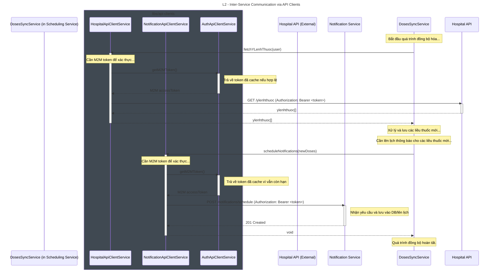

# Tài Liệu Kiến Trúc: Giao Tiếp Đồng Bộ Giữa Các Service (API Clients)

**Phiên bản:** 1.0
**Tác giả:** [Tên của bạn/Team]
**Ngày cập nhật:** [Ngày hôm nay]

## 1. Tổng Quan

Tài liệu này mô tả kiến trúc và quy trình chuẩn cho việc giao tiếp đồng bộ (Request/Response) giữa các microservices trong hệ thống. Để đảm bảo tính nhất quán, khả năng tái sử dụng và trừu tượng hóa, toàn bộ logic giao tiếp được đóng gói trong thư viện dùng chung **`@app/api-clients`** tại `libs/api-clients`.

### 1.1. Nguyên tắc Thiết kế

-   **Trừu tượng hóa (Abstraction):** Service "Gọi" (Caller) không cần biết chi tiết về cách gọi một service khác (URL, headers, phương thức xác thực). Nó chỉ cần inject một `*ApiClientService` và gọi một phương thức đã được định nghĩa rõ ràng (ví dụ: `notificationClient.scheduleNotifications(...)`).
-   **Tái sử dụng (Reusability):** Logic để lấy M2M token, đính kèm headers, và xử lý lỗi được viết một lần trong thư viện và tái sử dụng bởi tất cả các service.
-   **Nhất quán (Consistency):** Mọi giao tiếp service-to-service đều tuân theo một mẫu thiết kế duy nhất, giúp lập trình viên dễ dàng làm việc trên các service khác nhau.
-   **Phát hiện tại thời điểm biên dịch (Compile-time Safety):** Việc sử dụng các DTO (Data Transfer Objects) được chia sẻ trong thư viện giúp đảm bảo rằng payload của request và response luôn đúng định dạng.

## 2. Cấu trúc Thư viện `@app/api-clients`

Thư viện được tổ chức theo từng "domain" hoặc "resource" mà nó giao tiếp.

```
/libs/api-clients/src/
|
|--- /account/         # Client để gọi Account Service
|--- /auth/            # Client chuyên dụng cho việc lấy M2M token
|--- /doses/           # Client để gọi các API liên quan đến liều thuốc
|--- /hospital/        # Client để gọi API của hệ thống bệnh viện bên ngoài
|--- /notification/    # Client để gọi Notification Service
|
|--- api-clients.module.ts # Module tổng hợp, export tất cả các client module
```

Mỗi thư mục con (ví dụ: `/notification`) chứa:
-   `notification-api-client.module.ts`: Module NestJS để đóng gói service.
-   `notification-api-client.service.ts`: Service chứa logic gọi API thực tế.
-   `/dto/`: Thư mục chứa các DTO cho request và response.

## 3. Sơ đồ Tuần tự (Sequence Diagram)

Sơ đồ này minh họa một luồng nghiệp vụ thực tế: **`DosesSyncService`** (trong `scheduling-service`) gọi đến **`HospitalApiClientService`** và **`NotificationApiClientService`**.



## 4. Quy trình Sử dụng và Tích hợp

Để một service (ví dụ: `scheduling-service`) có thể sử dụng các API client, lập trình viên cần thực hiện các bước sau:

### 4.1. Import Module

Trong module của feature cần sử dụng (ví dụ: `JobsModule` trong `scheduling-service`), import các module client cần thiết.

**Ví dụ:**
```typescript
// apps/scheduling-service/src/jobs/jobs.module.ts

import { Module } from '@nestjs/common';
import { DosesSyncService } from './services/doses-sync.service';
import { HospitalApiClientModule } from '@app/api-clients/hospital/hospital-api-client.module';
import { NotificationApiClientModule } from '@app/api-clients/notification/notification-api-client.module';

@Module({
  imports: [
    // Import các module client cần thiết
    HospitalApiClientModule,
    NotificationApiClientModule,
  ],
  providers: [DosesSyncService, /* ... các providers khác */],
})
export class JobsModule {}
```

### 4.2. Inject Service

Sử dụng cơ chế Dependency Injection (DI) của NestJS để inject các service client vào constructor của service nghiệp vụ.

**Ví dụ:**
```typescript
// apps/scheduling-service/src/jobs/services/doses-sync.service.ts

import { Injectable } from '@nestjs/common';
import { HospitalApiClientService } from '@app/api-clients/hospital/hospital-api.service';
import { NotificationApiClientService } from '@app/api-clients/notification/notification-api-client.service';

@Injectable()
export class DosesSyncService {
    constructor(
        private readonly hospitalClient: HospitalApiClientService,
        private readonly notificationClient: NotificationApiClientService,
    ) {}

    public async syncAllDoses(user: User): Promise<void> {
        // Gọi các phương thức từ client đã được inject
        const allYlenhthuoc = await this.hospitalClient.fetchYLenhThuoc(user);
        // ...
        await this.notificationClient.scheduleNotifications(futureDoses);
    }
}
```

## 5. Nguyên tắc Mở rộng

Khi cần thêm giao tiếp với một service mới (ví dụ: `analytics-service`), quy trình chuẩn như sau:

1.  **Tạo Thư mục mới:** Trong `libs/api-clients/src`, tạo một thư mục mới tên là `analytics`.
2.  **Tạo Client Service & Module:** Bên trong thư mục `analytics`, tạo các file `analytics-api-client.service.ts` và `analytics-api-client.module.ts` theo mẫu đã có.
3.  **Triển khai Logic:** Viết các phương thức trong service mới để gọi các endpoint của `analytics-service`. Service này cũng sẽ inject `AuthApiClientService` để lấy M2M token.
4.  **Cập nhật Module Tổng:** Thêm `AnalyticsApiClientModule` vào `imports` và `exports` của file `libs/api-clients/src/api-clients.module.ts`.
5.  **Sử dụng:** Bất kỳ service nào khác giờ đây có thể import `AnalyticsApiClientModule` và inject `AnalyticsApiClientService` để sử dụng.

Việc tuân thủ quy trình này đảm bảo rằng hệ thống giao tiếp M2M của bạn luôn được tổ chức tốt, an toàn và dễ dàng mở rộng trong tương lai.