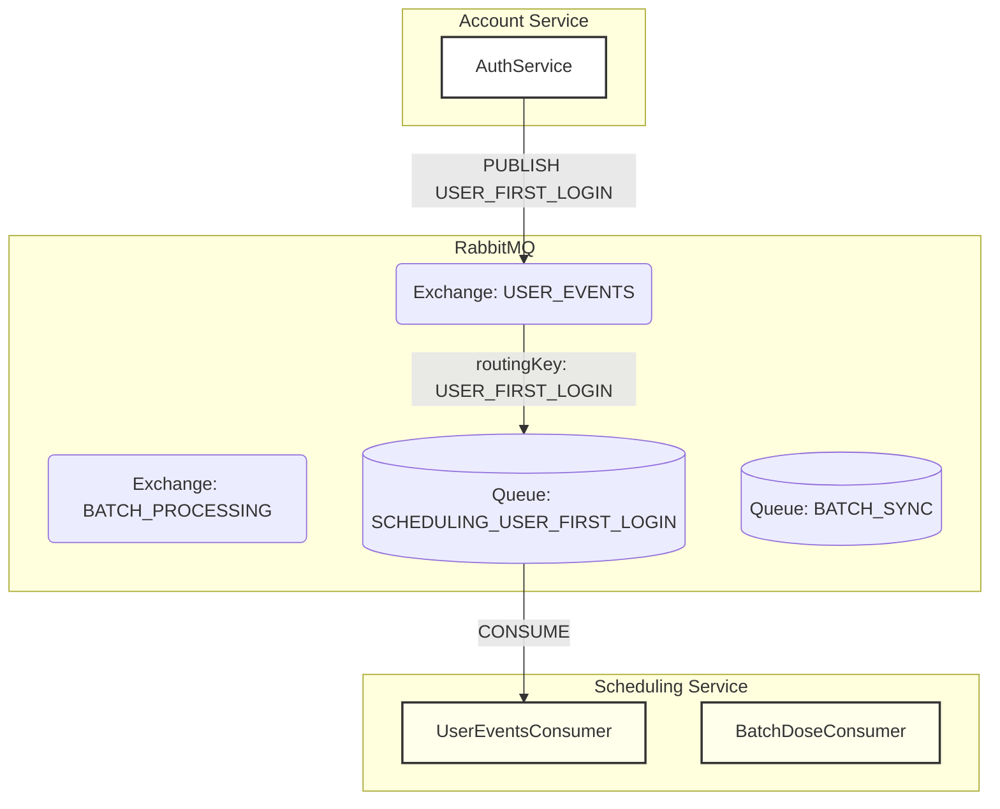

# Tài Liệu Kiến Trúc: Giao Tiếp Bất Đồng Bộ (RabbitMQ)

**Phiên bản:** 1.0
**Tác giả:** [Tên của bạn/Team]
**Ngày cập nhật:** [Ngày hôm nay]

## 1. Giới thiệu

Tài liệu này mô tả kiến trúc và các quy ước cho việc giao tiếp bất đồng bộ giữa các microservices trong hệ thống MedPlusApp bằng cách sử dụng RabbitMQ.

Mục tiêu chính của việc áp dụng kiến trúc hướng sự kiện (Event-Driven Architecture) là:
-   **Tăng khả năng mở rộng và phục hồi:** Các service có thể hoạt động độc lập. Nếu một service consumer tạm thời bị lỗi, các service publisher vẫn có thể hoạt động bình thường.
-   **Khớp nối lỏng (Loose Coupling):** Các service không cần biết về sự tồn tại của nhau, chúng chỉ cần biết về các "hợp đồng" sự kiện được định nghĩa trên message broker.
-   **Xử lý tác vụ nền:** Cho phép thực hiện các tác vụ tốn thời gian (như đồng bộ hóa dữ liệu) mà không làm ảnh hưởng đến trải nghiệm của người dùng.

## 2. Kiến trúc Tổng quan

Hệ thống sử dụng mô hình **Publisher/Subscriber** thông qua các **Exchanges** và **Queues** của RabbitMQ.

-   **Publisher:** Một service phát ra một sự kiện (message) đến một Exchange.
-   **Exchange:** Nhận message từ Publisher và định tuyến nó đến một hoặc nhiều Queues dựa trên loại Exchange và `routingKey`.
-   **Queue:** Một hàng đợi chứa các message chờ được xử lý.
-   **Consumer:** Một service lắng nghe trên một Queue và xử lý các message khi chúng đến.



## 3. Hợp đồng & Quy ước (Contracts & Conventions)

Toàn bộ cấu hình được định nghĩa tập trung tại `libs/common/src/rabbitmq` để đảm bảo tính nhất quán.

### 3.1. Exchanges (`libs/common/src/rabbitmq/exchanges.ts`)

| Tên Exchange (Constant)           | Giá Trị                         | Loại Exchange       | Mục Đích Nghiệp Vụ                                                                 |
| ---------------------------------- | -------------------------------- | ------------------- | ---------------------------------------------------------------------------------- |
| `ExchangeName.NOTIFICATION`        | `notification.exchange`         | `x-delayed-message` | Lên lịch gửi thông báo trong tương lai.                                            |
| `ExchangeName.SYNC`                | `sync.exchange`                  | `direct`            | Xử lý các yêu cầu đồng bộ dữ liệu (thủ công hoặc tự động).                         |
| `ExchangeName.BATCH_SYNC`          | `batch.sync.exchange`            | `x-delayed-message` | Xử lý đồng bộ dữ liệu theo lô, có thể trì hoãn để tối ưu tài nguyên.               |
| `ExchangeName.USER_EVENTS`         | `user.events.exchange`           | `direct`            | Xử lý các sự kiện liên quan đến vòng đời người dùng (tạo, cập nhật, đăng nhập...). |


---

### 3.2. Routing Keys (`libs/common/src/rabbitmq/routing-keys.ts`)

| Tên Routing Key (Constant)         | Giá Trị                       | Mục Đích Nghiệp Vụ                                                                 |
| ----------------------------------- | ----------------------------- | ---------------------------------------------------------------------------------- |
| `RoutingKey.USER_FIRST_LOGIN`       | `user.first_login`            | Phát ra khi người dùng đăng nhập lần đầu để kích hoạt quy trình khởi tạo dữ liệu. |
| `RoutingKey.USER_PROFILE_UPDATED`   | `user.profile_updated`        | Phát ra khi hồ sơ người dùng được cập nhật để đồng bộ với các service khác.       |
| `RoutingKey.SYNC_REQUEST`           | `sync.request`                | Gửi yêu cầu đồng bộ dữ liệu giữa các service.                                     |
| `RoutingKey.BATCH_START_FULL_SYNC`  | `batch.start_full_sync`       | Bắt đầu quy trình đồng bộ toàn bộ dữ liệu theo lô.                                |
| `RoutingKey.BATCH_PROCESS_SYNC`     | `batch.process_sync`          | Xử lý từng phần dữ liệu trong một batch đồng bộ.                                  |
| `RoutingKey.NOTIFICATION_SCHEDULE`  | `notification.schedule`       | Lên lịch gửi thông báo tại một thời điểm trong tương lai.                         |


---

### 3.3. Queues (`libs/common/src/rabbitmq/queues.ts`)

| Tên Queue (Constant)                  | Giá Trị                                  | Service Consumer       | Exchange Liên Kết               | Routing Key Liên Kết                  |
| -------------------------------------- | ---------------------------------------- | ---------------------- | -------------------------------- | -------------------------------------- |
| `QueueName.SCHEDULING_USER_FIRST_LOGIN`| `scheduling.user_first_login.queue`      | `scheduling-service`   | `ExchangeName.USER_EVENTS`       | `RoutingKey.USER_FIRST_LOGIN`          |
| `QueueName.SYNC_REQUESTS`              | `sync.requests.queue`                    | `scheduling-service`   | `ExchangeName.SYNC`               | `RoutingKey.SYNC_REQUEST`              |
| `QueueName.BATCH_CREATION`             | `batch.creation.queue`                   | `batch-service`        | `ExchangeName.BATCH_SYNC`         | `RoutingKey.BATCH_START_FULL_SYNC`     |
| `QueueName.BATCH_SYNC`                  | `batch.sync.queue`                       | `batch-service`        | `ExchangeName.BATCH_SYNC`         | `RoutingKey.BATCH_PROCESS_SYNC`        |
| `QueueName.NOTIFICATION_SCHEDULER`     | `notification.scheduler.queue`           | `notification-service` | `ExchangeName.NOTIFICATION`       | `RoutingKey.NOTIFICATION_SCHEDULE`     |


## 4. Luồng Sự kiện Chính: `user.first_login`

Đây là luồng được kích hoạt khi một người dùng mới đăng nhập lần đầu tiên.

-   **Mô tả:** Sau khi `Account Service` tạo tài khoản người dùng thành công, nó sẽ phát một sự kiện để thông báo cho các service khác. `Scheduling Service` sẽ lắng nghe sự kiện này để bắt đầu quá trình đồng bộ hóa toàn bộ lịch sử và lịch trình thuốc cho người dùng mới.

-   **Sơ đồ Tuần tự:**
    ```mermaid
    sequenceDiagram
        title Event Flow: user.first_login

        participant Account Service
        participant RabbitMQ
        participant Scheduling Service
        participant Hospital API
        participant Schedule DB

        Account Service->>RabbitMQ: PUBLISH 'user.first_login' (payload)
        
        note over RabbitMQ, Scheduling Service: Asynchronously
        RabbitMQ-->>Scheduling Service: Consume event
        activate Scheduling Service

        note over Scheduling Service: Consumer: UserEventsConsumer.handleUserFirstLogin()
        Scheduling Service->>Account Service: fetchUserByIdentifier(user_id)
        Account Service-->>Scheduling Service: User object

        note over Scheduling Service: Service: DosesSyncService.syncAllDoses()
        Scheduling Service->>Hospital API: fetchYLenhThuoc(user)
        Hospital API-->>Scheduling Service: All treatment records

        Scheduling Service->>Schedule DB: DELETE old doses
        Schedule DB-->>Scheduling Service: OK

        Scheduling Service->>Schedule DB: INSERT new doses
        Schedule DB-->>Scheduling Service: OK

        Scheduling Service->>Notification Service: scheduleNotifications(futureDoses)
        Notification Service-->>Scheduling Service: OK
        
        deactivate Scheduling Service
    ```

-   **Chi tiết Kỹ thuật:**
    *   **Publisher:** `AuthService` trong `account-service`.
    *   **Consumer:** `UserEventsConsumer` trong `scheduling-service`.
    *   **Payload:** `{ user_id: string, mabn: string }`.
    *   **Xử lý lỗi:** Nếu quá trình đồng bộ hóa thất bại, consumer sẽ trả về `new Nack(false)`. Message sẽ được chuyển đến Dead Letter Queue (DLQ) để điều tra thủ công.

## 5. Chiến lược Xử lý Lỗi & Dead Letter Queue (DLQ)

-   **Tính Bất biến (Idempotency):** Tất cả các consumer phải được thiết kế để có thể xử lý cùng một message nhiều lần mà không gây ra tác dụng phụ. Ví dụ: `syncAllDoses` xóa dữ liệu cũ trước khi thêm mới, đảm bảo tính bất biến.
-   **Dead Lettering:** Mọi queue trong hệ thống đều được cấu hình với một Dead Letter Exchange (DLX) và Dead Letter Queue (DLQ) tương ứng. Khi một message bị `Nack(false)`, nó sẽ được chuyển đến DLQ.
-   **Cảnh báo:** Hệ thống giám sát (Monitoring) sẽ gửi cảnh báo cho đội ngũ vận hành khi có message xuất hiện trong bất kỳ DLQ nào.