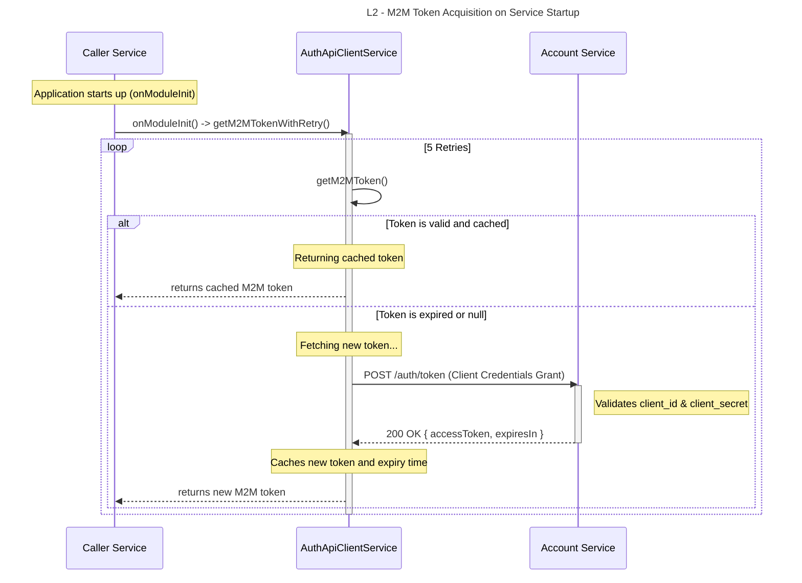
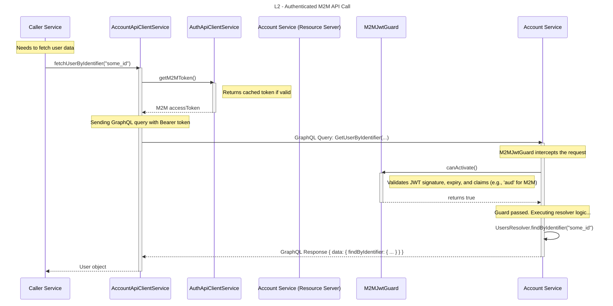

# Tài Liệu Kiến Trúc: Luồng Xác Thực Machine-to-Machine (M2M)

**Phiên bản:** 1.0
**Tác giả:** [Tên của bạn/Team]
**Ngày cập nhật:** [Ngày hôm nay]

## 1. Tổng Quan

Tài liệu này mô tả chi tiết cơ chế xác thực và ủy quyền cho việc giao tiếp giữa các microservices (Machine-to-Machine hay M2M) trong hệ thống. Mục tiêu là đảm bảo rằng các service chỉ có thể giao tiếp với nhau một cách an toàn, được xác thực, và có kiểm soát.

Luồng này sử dụng **OAuth 2.0 Client Credentials Grant**, một tiêu chuẩn ngành cho xác thực M2M. Trong đó:
*   **`Account Service`** đóng vai trò là **Authorization Server**, chịu trách nhiệm cấp phát token truy cập.
*   Các service khác (ví dụ: `Scheduling Service`, `Notification Service`) đóng vai trò là **Client**, cần phải xác thực bản thân để nhận token trước khi gọi API của các service khác.

## 2. Các Thành Phần Tham Gia

| Thành Phần                 | Thư Viện Liên Quan (`libs`) | Vai Trò                                                                                             |
| -------------------------- | --------------------------- | --------------------------------------------------------------------------------------------------- |
| **Service "Gọi" (Caller)** | `api-clients`               | Bất kỳ service nào cần gọi API của một service khác (ví dụ: `Scheduling Service`).                  |
| **Service "Được Gọi" (Callee)** | `auth`                      | Service cung cấp API và cần bảo vệ tài nguyên của mình (ví dụ: `Account Service`).                   |
| **`AuthApiClientService`** | `api-clients/auth`          | Client chuyên dụng, chịu trách nhiệm lấy và quản lý M2M token từ `Account Service`.                 |
| **`AccountApiClientService`**| `api-clients/account`       | Client để gọi các API cụ thể của `Account Service`, sử dụng token được cung cấp bởi `AuthApiClientService`. |
| **`M2MJwtGuard`**          | `auth`                      | Một NestJS Guard, được đặt trên các API endpoint để xác thực M2M token.                             |

## 3. Sơ Đồ Tuần Tự (Sequence Diagram)

Sơ đồ này mô tả hai giai đoạn chính:
1.  **Khởi tạo & Lấy Token (Token Acquisition):** Service "Gọi" khởi động và lấy M2M token lần đầu.
2.  **Gọi API được bảo vệ (Authenticated API Call):** Service "Gọi" sử dụng token đã có để truy cập tài nguyên của Service "Được Gọi".

### 3.1. Luồng Lấy Token M2M Khi Khởi Động

### 3.2. Luồng Gọi API M2M Được Bảo Vệ

## 4. Phân Tích Kỹ Thuật Chi Tiết

### 4.1. Cơ Chế Lấy và Quản Lý Token (`AuthApiClientService`)

-   **Khởi tạo Tự động:** Khi một service import `ApiClientsModule`, `AuthApiClientService` sẽ được khởi tạo. Phương thức `onModuleInit` được kích hoạt, tự động gọi `getM2MTokenWithRetry`.
-   **Cơ chế Thử lại (Retry):** Việc lấy token ban đầu có cơ chế thử lại (5 lần, mỗi lần cách nhau 3 giây). Điều này tăng cường khả năng phục hồi của hệ thống khi khởi động, phòng trường hợp `Account Service` chưa sẵn sàng.
-   **Bộ đệm (Caching):** Token sau khi lấy về sẽ được lưu vào bộ nhớ đệm (`this.m2mToken`). Các lời gọi tiếp theo sẽ sử dụng token này cho đến khi nó gần hết hạn (còn 60 giây), giúp giảm thiểu số lượng request không cần thiết đến `Account Service`.
-   **Cấu hình tập trung:** Toàn bộ thông tin nhạy cảm (`URL`, `clientId`, `clientSecret`) được quản lý qua biến môi trường và inject thông qua `ConfigService`, tuân thủ nguyên tắc bảo mật.

### 4.2. Bảo Vệ Endpoint (`M2MJwtGuard`)

-   **Trách nhiệm:** `M2MJwtGuard` là một NestJS Guard chuyên dụng, được áp dụng cho các GraphQL Query/Mutation cần được bảo vệ ở cấp độ M2M.
-   **Cơ chế hoạt động:**
    1.  Guard sẽ trích xuất JWT token từ header `Authorization`.
    2.  Nó sử dụng một "strategy" (ví dụ: `passport-jwt`) được cấu hình với một `secret` riêng dành cho M2M token.
    3.  Nó xác thực chữ ký, thời gian hết hạn (`exp`), và có thể kiểm tra các `claims` khác như `audience` (`aud`) hoặc `scope` để đảm bảo token này được cấp cho đúng mục đích M2M.
    4.  Nếu hợp lệ, request được phép đi tiếp vào resolver. Nếu không, nó sẽ trả về lỗi `401 Unauthorized`.

### 4.3. Tái Sử Dụng và Mở Rộng

-   **Thư viện `api-clients`:** Việc đóng gói logic gọi API vào một thư viện dùng chung (`libs/api-clients`) là một thực hành xuất sắc trong monorepo. Nó giúp:
    *   **Tránh lặp code:** Các service không cần phải tự viết logic `HttpService` và quản lý token.
    *   **Trừu tượng hóa:** Service "Gọi" chỉ cần gọi một phương thức đơn giản như `accountApiClient.fetchUserByIdentifier(...)` mà không cần quan tâm đến việc token được lấy và đính kèm như thế nào.
    *   **Dễ dàng cập nhật:** Nếu cơ chế xác thực thay đổi, bạn chỉ cần cập nhật `AuthApiClientService` ở một nơi duy nhất.
-   **Thư viện `auth`:** Tương tự, việc đóng gói `M2MJwtGuard` và các decorator liên quan vào `libs/auth` giúp các service có thể dễ dàng áp dụng cơ chế bảo mật một cách nhất quán.
