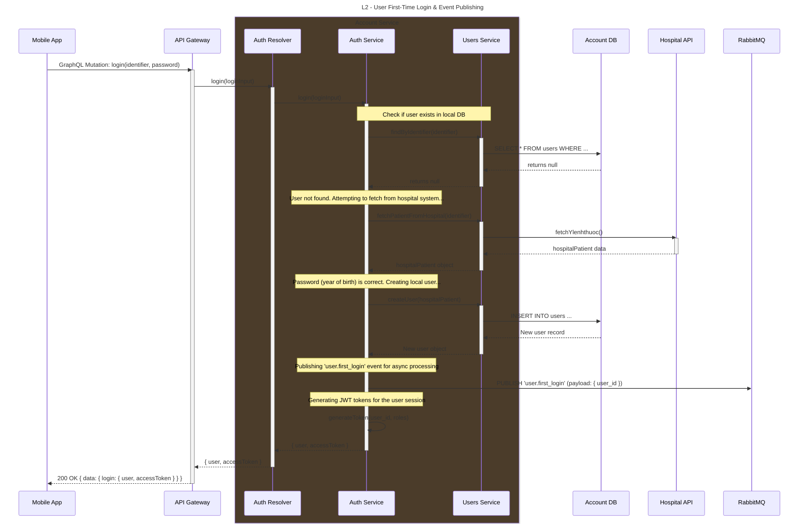

# Sequence Diagram: User First-Time Login

**Version:** 1.1
**Author:** [Your Name/Team]
**Last Updated:** [Date]

## 1. Overview

This diagram illustrates the **happy path** for a user's first-time login. The process involves authenticating the user against an external hospital system, creating a local user profile, issuing authentication tokens, and publishing an asynchronous event to trigger downstream processes like data synchronization.

## 2. Actors & Lifelines

| Actor / Component      | Description                                                                                             |
| ---------------------- | ------------------------------------------------------------------------------------------------------- |
| **User**               | The end-user interacting with the mobile application.                                                   |
| **Mobile App**         | The client application running on the user's device.                                                    |
| **API Gateway**        | The single entry point for all client requests, responsible for routing to the appropriate microservice.  |
| **Account Service**    | The microservice responsible for identity and access management. Internally composed of:                  |
| &nbsp;&nbsp;Auth Resolver | The GraphQL entry point within the Account Service.                                                     |
| &nbsp;&nbsp;Auth Service    | Contains the core business logic for authentication.                                                    |
| &nbsp;&nbsp;Users Service    | Manages user data persistence and interaction with external user sources.                               |
| **Account DB**         | The primary database for the Account Service.                                                           |
| **Hospital API**       | An external, third-party API for fetching initial patient data.                                         |
| **RabbitMQ**           | The message broker used for asynchronous communication between services.                                |

## 3. Preconditions

- The user does not have an existing account in the `Account DB`.
- The user's `identifier` and `password` (year of birth) are valid in the `Hospital API`.

## 4. Diagram

## 5. Postconditions

- A new user record is created in the `Account DB`.
- The user receives a valid `accessToken` and `refreshToken`.
- A `user.first_login` event is published to the `USER_EVENTS_EXCHANGE` in RabbitMQ.
- The client application stores the tokens and navigates the user to the main screen.

## 6. Key Technical Notes

- **GraphQL Mutation:** The entry point is a GraphQL mutation, not a REST endpoint. The `Auth Resolver` handles the incoming request.
- **Internal Service Communication:** The diagram clearly shows the separation of concerns between `Auth Service` (business logic) and `Users Service` (data access).
- **Event-Carried State Transfer:** The `user.first_login` event payload should contain essential, stable information (`user_id`, `mabn`) required by downstream consumers. This reduces the need for immediate API callbacks to the `Account Service`, improving system resilience.
- **Security:** The `password` (year of birth) is used for a one-time verification only. The newly created user in `Account DB` should have a properly hashed password, which can be set during a "complete profile" step or generated randomly and sent via a secure channel.