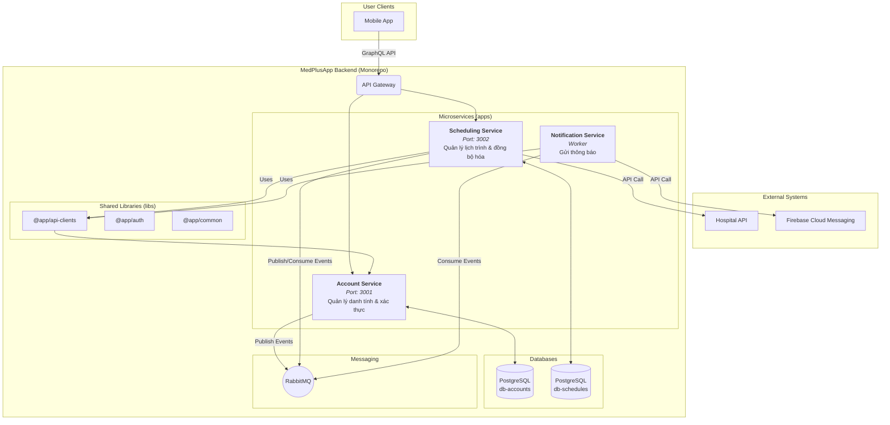
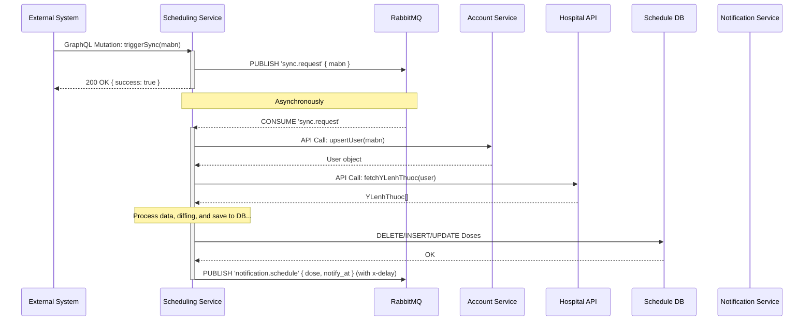
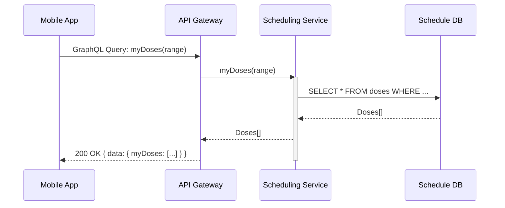

# Tài Liệu Kiến Trúc & Vận Hành: Hệ thống Nhắc lịch Uống thuốc (MedPlusApp Backend)

**Phiên bản:** 1.0.0
**Ngày cập nhật:** [Ngày hôm nay]

## 1. Tổng Quan & Mục Tiêu

Dự án này là một hệ thống backend được xây dựng trên nền tảng **NestJS** và kiến trúc **Microservices**, phục vụ cho ứng dụng di động giúp bệnh nhân theo dõi và tuân thủ lịch uống thuốc theo y lệnh từ bệnh viện.

### 1.1. Mục tiêu chính

-   **Tự động hóa:** Tự động đồng bộ hóa y lệnh từ hệ thống bệnh viện và tạo ra lịch trình uống thuốc chi tiết, giảm thiểu sai sót thủ công.
-   **Nhắc nhở kịp thời:** Gửi thông báo đẩy (push notification) đến thiết bị của người dùng một cách chính xác và đúng giờ.
-   **Độ tin cậy cao:** Sử dụng Message Broker (RabbitMQ) để đảm bảo không bỏ lỡ bất kỳ yêu cầu hay thông báo nào, ngay cả khi có lỗi tạm thời.
-   **Bảo mật:** Phân tách rõ ràng giữa dữ liệu người dùng và giao tiếp giữa các thành phần hệ thống thông qua cơ chế xác thực M2M (Machine-to-Machine).
-   **Khả năng mở rộng:** Kiến trúc microservices cho phép dễ dàng thêm mới các tính năng và dịch vụ trong tương lai mà không ảnh hưởng đến các thành phần hiện có.

## 2. Kiến trúc Hệ thống

Hệ thống được xây dựng dựa trên kiến trúc microservices, quản lý trong một **monorepo**. Mỗi service là một ứng dụng NestJS độc lập, sở hữu database riêng và giao tiếp với nhau qua hai kênh chính:
-   **Đồng bộ (Synchronous):** Qua các API nội bộ (GraphQL/REST), được trừu tượng hóa bởi thư viện `@app/api-clients`.
-   **Bất đồng bộ (Asynchronous):** Qua Message Broker (RabbitMQ), được quản lý bởi thư viện `@app/common`.

### 2.1. Sơ đồ Kiến trúc Tổng quan



### 2.2. Chi tiết các Microservices

#### 2.2.1. Account Service
-   **Cổng:** `3001`
-   **Database:** `db-accounts` (PostgreSQL)
-   **Trách nhiệm:**
    -   Quản lý danh tính người dùng (`User` entity: email, password, mabn, roles).
    -   Xử lý xác thực người dùng (đăng ký, đăng nhập) qua **GraphQL**.
    -   Cung cấp endpoint **REST** (`/auth/token`) để xác thực M2M cho các service khác.
    -   Quản lý token thông báo đẩy (`fcmTokens`).
    -   Cung cấp API nội bộ để các service khác truy vấn thông tin user.

#### 2.2.2. Scheduling Service
-   **Cổng:** `3002`
-   **Database:** `db-schedules` (PostgreSQL)
-   **Trách nhiệm:**
    -   Là bộ não xử lý nghiệp vụ chính của hệ thống.
    -   Cung cấp API **GraphQL** cho client để xem lịch trình (`myDoses`) và cập nhật trạng thái (`updateDoseStatus`).
    -   Tiếp nhận yêu cầu đồng bộ y lệnh và phát sự kiện vào RabbitMQ để xử lý nền.
    -   Chứa `DosesSyncService` với logic cốt lõi: gọi API bệnh viện, phân tích y lệnh, tạo/cập nhật/xóa các `Dose`.
    -   Phát các sự kiện "cần gửi thông báo" vào RabbitMQ với độ trễ (`x-delayed-message`).

#### 2.2.3. Notification Service
-   **Cổng:** Không có (Là một worker "headless", không tiếp nhận request HTTP trực tiếp).
-   **Database:** Không có (Stateless).
-   **Trách nhiệm:**
    -   Thực hiện một nhiệm vụ duy nhất: gửi thông báo.
    -   Chứa `NotificationConsumer` lắng nghe các sự kiện từ RabbitMQ.
    -   Khi nhận được sự kiện, nó sẽ gọi đến `Account Service` (thông qua `@app/api-clients`) để lấy `fcmTokens` của người dùng.
    -   Sử dụng `Firebase Admin SDK` để gửi thông báo đẩy qua FCM.

## 3. Ngăn xếp Công nghệ (Technology Stack)

| Hạng mục                  | Công nghệ / Công cụ                               |
| ------------------------- | ------------------------------------------------- |
| **Nền tảng & Framework**  | TypeScript, Node.js, NestJS (v11+)                |
| **Giao tiếp API**         | GraphQL (`@nestjs/graphql`), REST (`@nestjs/axios`)|
| **Giao tiếp Bất đồng bộ** | RabbitMQ (`@golevelup/nestjs-rabbitmq`)           |
| **Cơ sở dữ liệu & ORM**   | PostgreSQL (`pg`), TypeORM                        |
| **Xác thực & Ủy quyền**   | Passport.js, JWT (`@nestjs/jwt`), bcrypt          |
| **Tích hợp Bên ngoài**    | Firebase Admin SDK                                |
| **Containerization**      | Docker, Docker Compose                            |
| **Công cụ Phát triển**    | ESLint, Prettier, Jest, Concurrently              |

## 4. Hướng dẫn Cài đặt & Vận hành Môi trường Phát triển

### 4.1. Yêu cầu
-   Node.js (v18+)
-   npm (v9+)
-   Docker & Docker Compose

### 4.2. Cài đặt
1.  **Clone repository:**
    ```bash
    git clone <repository_url>
    cd <repository_folder>
    ```
2.  **Cài đặt dependencies:**
    ```bash
    npm install
    ```
3.  **Thiết lập file môi trường (`.env`):**
    -   Tạo file `.env` cho mỗi service trong thư mục `apps/<service-name>/`.
    -   Tham khảo file `.env.example` (nếu có) để điền các giá trị cần thiết (thông tin kết nối DB, RabbitMQ URI, JWT Secret, URL của các service khác).
4.  **Thiết lập Firebase:**
    -   Tải file `firebase-service-account.json` từ Firebase Console.
    -   Đặt file này vào thư mục gốc của dự án.

### 4.3. Chạy dự án
1.  **Khởi động hạ tầng (DB, RabbitMQ):**
    ```bash
    npm run docker:up
    ```
2.  **Khởi động tất cả các microservice (chế độ watch):**
    ```bash
    npm run dev
    ```
    Lệnh này sẽ khởi động đồng thời 3 service. Log của mỗi service sẽ được gắn tiền tố và tô màu để dễ phân biệt. Mọi thay đổi trong code sẽ tự động reload service tương ứng.

### 4.4. Các cổng truy cập
-   **Account Service GraphQL:** `http://localhost:3001/graphql`
-   **Scheduling Service GraphQL:** `http://localhost:3002/graphql`
-   **RabbitMQ Management UI:** `http://localhost:15672` (user: `user`, pass: `password`)

## 5. Luồng Dữ liệu Chính

### 5.1. Luồng Đồng bộ Y lệnh (Bất đồng bộ)



### 5.2. Luồng Tương tác của Người dùng (Đồng bộ)



## 6. Thư viện Dùng chung (`libs`)

-   **`@app/api-clients`**: Chứa các service client đã được cấu hình sẵn (`HttpModule`, `AuthApiClientService`) để giao tiếp an toàn và nhất quán giữa các microservice.
-   **`@app/auth`**: Chứa các Guard (`JwtAuthGuard`, `M2MJwtGuard`) và các Decorator (`@CurrentUser`) để tái sử dụng logic xác thực và ủy quyền.
-   **`@app/common`**: Chứa các DTO, Enum, hằng số (ví dụ: cấu hình RabbitMQ), và các tiện ích dùng chung cho toàn bộ hệ thống.

---